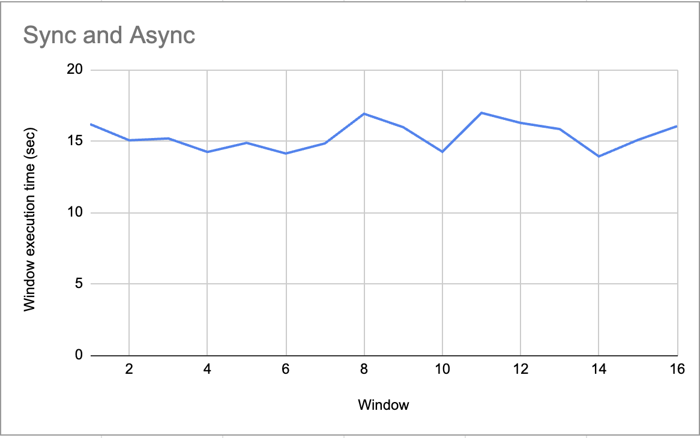
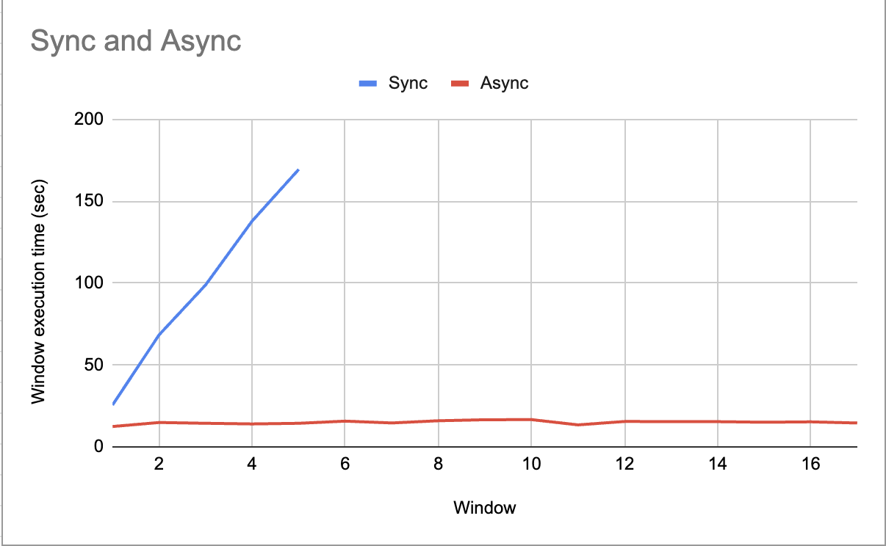
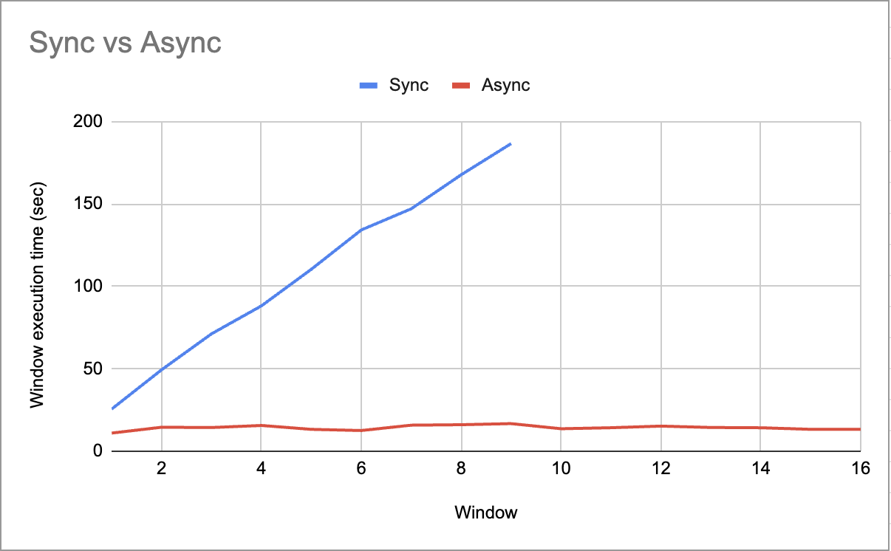

#  Async-IO Examples

The following are examples of writing UDFs using asynchronous programming techniques. 

We could define asynchronous programming as the way of executing programming code in a thread without having to wait for an I/O-bound or CPU-bound task to finish. I/O-bound operations could be file-system accesses, HTTP requests, API calls, or database queries. And CPU-bound operations would be actions like encrypting data, complex calculations, image or document management.

We focus on writing UDFs in Python for using numaflow-python sdk and Asyncio library.

### Scenario 1 - Using Async functions
In the file [async_exec.py](async_exec.py), we have covered an example of a UDF for making HTTP requests in an async manner. We have used the aiohttp library to make async calls instead of the standard requests library. 

The following async function returns a coroutine for executing each http request. 
```
async def http_request(session, url):
```
We collect all the coroutines that are to be executed in a list, and then run them concurrently using the gather function. The results are then collected, and can be further propagated.
```
results = await asyncio.gather(*tasks)
```

To compare the _performance_ of the Async implementation vs the sequential implementation we run and compare the results on the following scenarios for making http requests through our UDF.

The window size for the reduce function is 10s

#### 1) Input RPU:10/s, I/O delay: 0sec


#### 2) Input RPU:100/s, I/O delay: 200µs


#### 3) Input RPU:100/s, I/O delay: 0s


#### 4) Input RPU:100/s, I/O delay: 1sec


Here we can see that a low throughput, sequential and async have comparable performance, but as the I/O bound nature increases async starts to outperform the sequential implementation considerably. 


### Scenario 2 - Using legacy functions with executors
Another way of programming for the async paradigm can be the use of ThreadPool or ProcessPool executors.  As their names suggest, the **ThreadPool** uses threads internally and they are suitable for I/O bound tasks. Whereas the **ProcessPool** uses processes to execute calls asynchronously and are favorable for tasks with heavy CPU requirement.

One upside of using the executor approach is that we do not need to rewrite the legacy function using async mechanism, rather can be directly passed to executor. 

Both of the executors create a pool of _max_workers_ number of threads/processes. This argument can be specified manually during initialization in accordance with the need of the programmer, otherwise this would use the default value.


We have written a wrapper class for the executor pools implementation with the intent to provide a convenience function, Default executor pool would work just as well in the use case.

```
threadPool = ExecutorPool(exec_type=e_type, max_workers=max_workers)
```

##  Build image

  

```shell

make image

```
