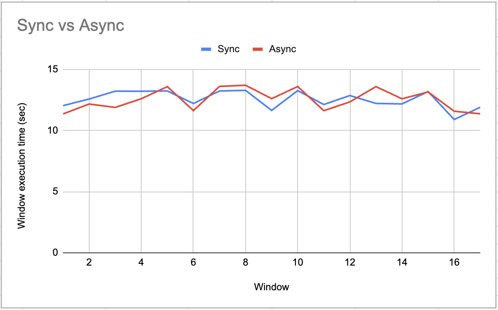
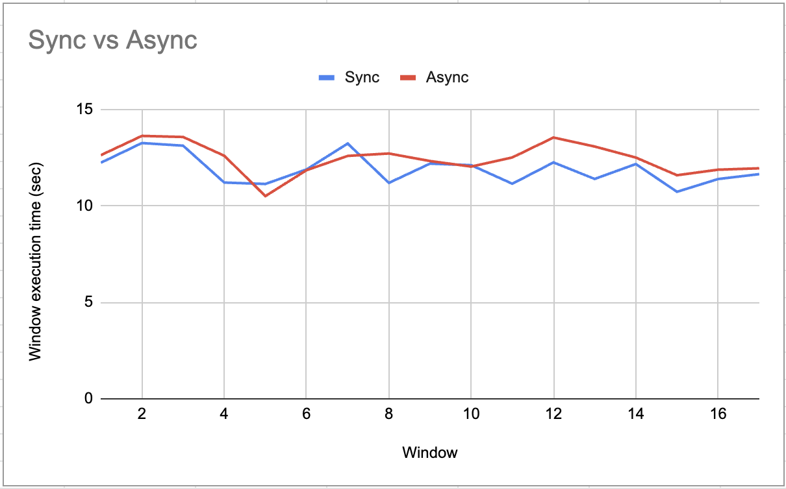
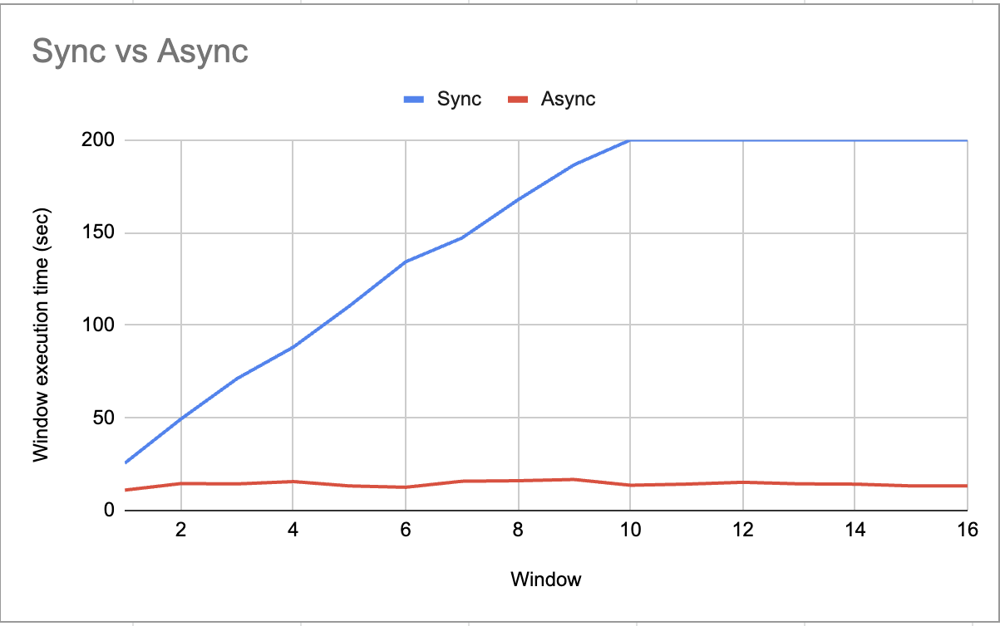
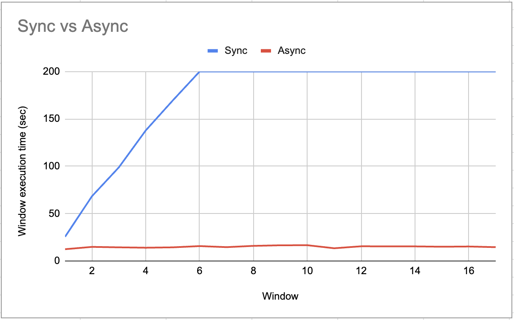
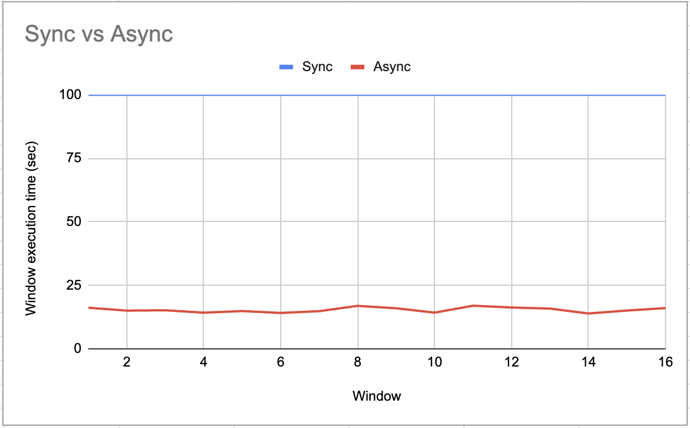
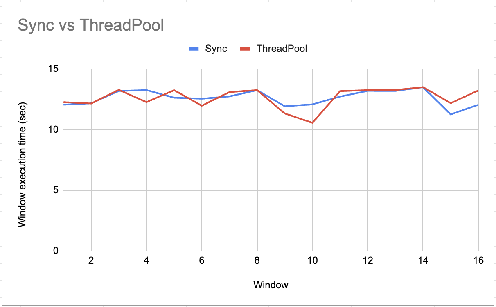
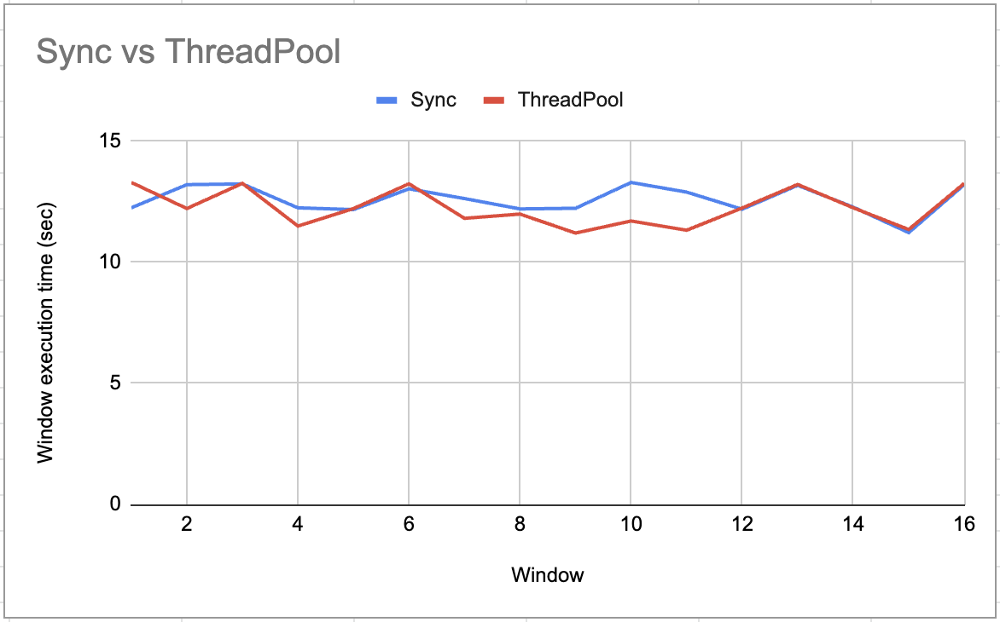
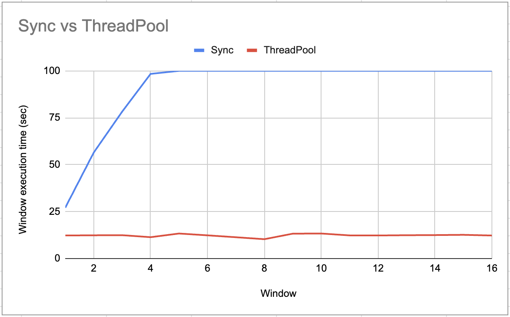
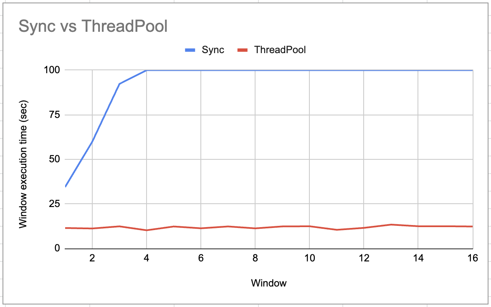
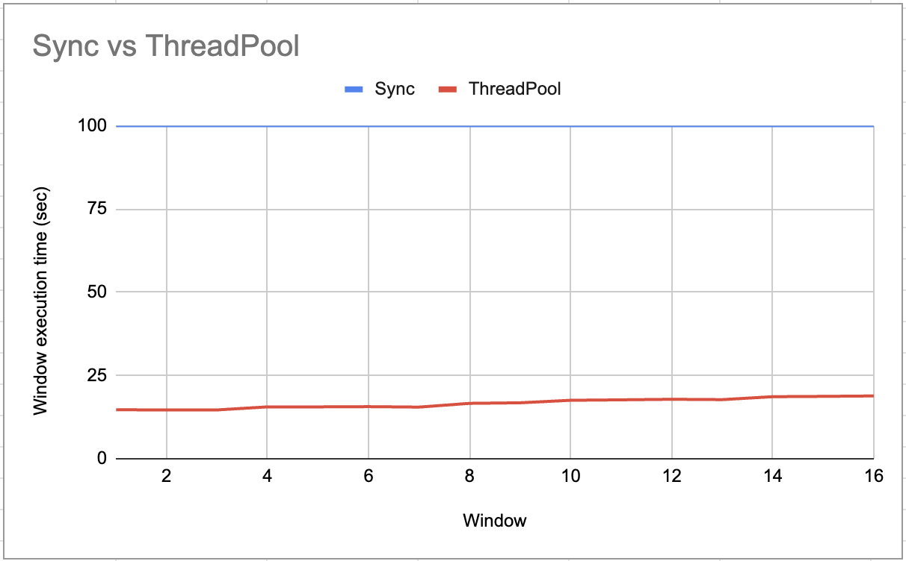

#  Async-IO Examples
`pynumaflow` supports only asyncio based Reduce UDFs because we found that the procedural Python is not able to handle 
any substantial traffic. 

The example can be used as a starter guide for writing asynchronous Reduce UDF using the famed asyncio builtin 
module.

Asyncio is used as a foundation for multiple Python asynchronous frameworks that provide high-performance network and 
webservers, database connection libraries, distributed task queues, etc. It is often a perfect fit for IO-bound and 
high-level structured network code.

We focus on writing UDFs in Python by using numaflow-python sdk and `asyncio` library.

### Scenario 1 - Using Async functions
In the file [async_exec.py](async_exec.py), we have covered an example of a UDF for making HTTP requests in an async 
manner. We have used the aiohttp library to make async calls instead of the standard requests library. 

The following async function returns a coroutine for executing each http request.
```python
async def http_request(session, url):
```
We first collect all the coroutines that are to be executed in a list, and then run them concurrently using the gather 
function. The results are then collected, and can be further propagated.
```python
results = await asyncio.gather(*tasks)
```

**To compare the performance of the Async and the sequential implementation we run and compare the results
on the following scenarios on an http server.**

Input RPU -> Number of messages generated per sec

Reduce Window Size - 10 sec

|              Input RPU:10 &nbsp; I/O delay: 0              |             Input RPU:10 &nbsp; I/O delay: 200µs             | Input RPU:10 &nbsp; I/O delay: 1sec *                       |
|:----------------------------------------------------------:|:------------------------------------------------------------:|-------------------------------------------------------------|
|  |  |  |


|             Input RPU:100 &nbsp; I/O delay: 0 *             |            Input RPU:100 &nbsp; I/O delay: 200µs *            | Input RPU:100 &nbsp; I/O delay: 1sec *                       |
|:-----------------------------------------------------------:|:-------------------------------------------------------------:|--------------------------------------------------------------|
|  |  |  |

**Note:** Flat line at time=100 for sync indicates no results for that window in the pipeline

Here we can see that a low throughput, sequential and async have comparable performance, but as the I/O bound nature 
increases async starts to outperform the sequential implementation considerably. It can be observed that at higher 
loads, the sequential executions seems to error out and not process any results.

### Scenario 2 - Using legacy functions with executors
Another way of programming for the async paradigm can be the use of ThreadPool or ProcessPool executors 
(Refer: [executorpool.py](executorpool.py)).  As their names suggest, the **ThreadPool** uses threads internally 
and they are suitable for I/O bound tasks. Whereas the **ProcessPool** uses processes to execute calls asynchronously 
and are favorable for tasks with heavy CPU requirement.

One upside of using the executor approach is that we do not need to rewrite the legacy function using async mechanism, 
rather they can be directly passed to executor. 

Both executors create a pool of _max_workers_ number of threads/processes. This argument can be specified 
manually during initialization in accordance with the need of the programmer, otherwise this would use the default value.

We have written a wrapper class for the executor pools implementation with the intent to provide a convenience function,
Default executor pool would work just as well in the use case.

```python
threadPool = ExecutorPool(exec_type=e_type, max_workers=max_workers)
```

**To compare the performance of the ThreadPool implementation vs the sequential implementation we run and compare the 
results on the following scenarios on an http server. Here we use the same http request helper function for both the
implementations.**

Testing has _max_workers = 100_

|                 Input RPU:10 &nbsp; I/O delay: 0                 |                Input RPU:10 &nbsp; I/O delay: 200µs                | Input RPU:10 &nbsp; I/O delay: 1sec *                            |
|:----------------------------------------------------------------:|:------------------------------------------------------------------:|------------------------------------------------------------------|
|  |  |  |


|                Input RPU:100 &nbsp; I/O delay: 0 *                |               Input RPU:100 &nbsp; I/O delay: 200µs *               | Input RPU:100 &nbsp; I/O delay: 1sec *                             |
|:-----------------------------------------------------------------:|:-------------------------------------------------------------------:|--------------------------------------------------------------------|
|  |  |  |

**Note** Flat line at time=100 for sync indicates no results for that window in the pipeline

We can see that the ThreadPool implementation gives a considerably better performance at higher throughput and I/O 
delay. But it should be kept in mind that the performance will vary according to the max_workers configured for the 
executor and that should be done carefully according to the use case.